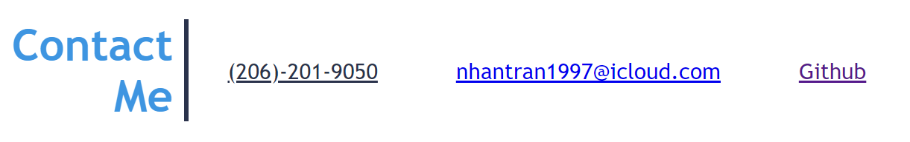

# My-Personal-Professional-Porfolio

## Description

The idea of this project was to create a portfolio webpage where I can present and showcase my projects
and applications as a Full Stack Developer. This portfolio webpage is a great opportunity for me to review, practice and apply what we recently learned to a real life scenario. In addition, I had to do quite a bit of researching online and debugging the webpage for errors. Throughout this project, I learned that it's always good to take a step back and try to solve one issue at a time. 

## Installation

<li>First, you need to create a repo on GitHub and clone your starting files to your device. </li>
<li>Use Terminal to navigate the cloned files on your device.</li>
<li>Write code in VS and complete Git flow throughout the process to save all changes made to Github.</li>
<li>Publish site and make sure to run tests on all features and requirements. </li>

## Links
<li> Github Repo URL: </li>

https://github.com/nathantr97/My-Personal-Professional-Porfolio

<li> Application Live URL: </li>

https://nathantr97.github.io/My-Personal-Professional-Porfolio/

## Usage

<li> Click on the navigation bar on the top right of the page to scroll to the corresponding section. </li>

<li> Click on the "User Optimization (HTML/CSS)" image to direct users to a new tab showing all applications. </li> 

<li> Click on "Indeed" or "LinkedIn" images to see resume. </li>

<li> At the bottom of the webpage, click on "Github" to see dev's repos. </li>

## Credits

<li> CSS Syntex </li>

https://www.w3schools.com/css/css_syntax.asp

<li> CSS Dimension Guide </li>

https://www.w3schools.com/css/css_dimension.asp
